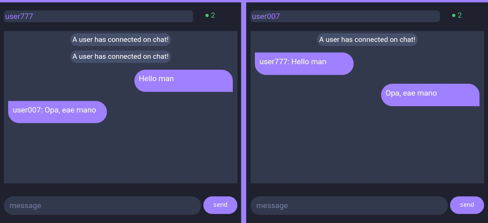

## Chat Nodejs

> A simple chat made with express and [socket.io](https://socket.io/get-started/chat).

### How to use ?

- Run `npm i` to install the packages.

- Start chat with `node index.js`

- And then open the url `http://localhost:4444/` to access the chat.

##

### What's in the chat?

- [x] I'ts possible send messages.
- [x] At the bottom of the chat is shown the user who is typing.
- [x] In chat shows if a new user has joined or left the chat.

#
